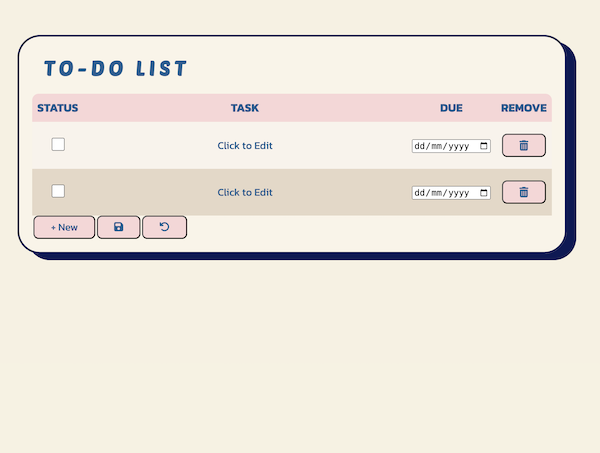

# To-Do List Project

Welcome to the To-Do List project! This application was developed as part of my
studies with HackYourFuture Belgium, aimed at deepening my understanding of
JavaScript.

## Project Goals

The primary goal of this project was to implement the following features:

- **Viewing Items:** Users can see all the items in their to-do list
- **Adding Items:** Users can add new items to their list.
- **Removing Items:** Users can remove any item from their list.
- **Editing Items:** Users can edit the description of each item in their list.
- **Marking Items:** Users can mark an item as "done" or "not done".

## Additional Features

In addition to the core functionalities, I explored the following additional
features:

- **Local Storage:** Implemented the use of localhost to allow users to save
  their to-do list locally.

## What I have learned during this project

- **JavaScript Fundamentals:** such as event handling and DOM manipulation.
- **Separation of Concerns:** Implemented a well-organized code structure,
  separating UI and logic to enhance maintainability.
- **Debugging:** through debugging and resolving issues encountered during
  development.

## Future Development Goals

- Looking forward, my aim is to expand the functionality of this to-do list to
  align with the specifications outlined in
  [Project: Todo List by the odin project](https://www.theodinproject.com/lessons/node-path-javascript-todo-list#project-solution)

  This includes implementing features such as:

  > Your todo list should have projects or separate lists of todos. When a user
  > first opens the app, there should be some sort of ‘default’ project to which
  > all of their todos are put. Users should be able to create new projects and
  > choose which project their todos go into.
